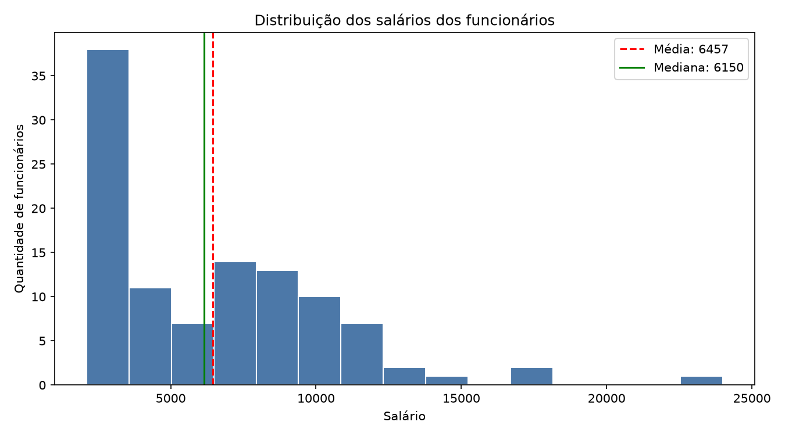
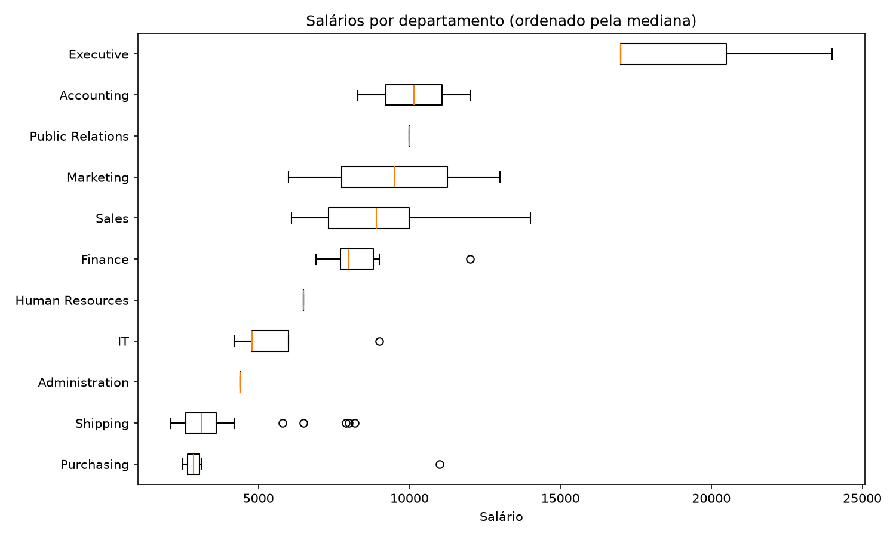
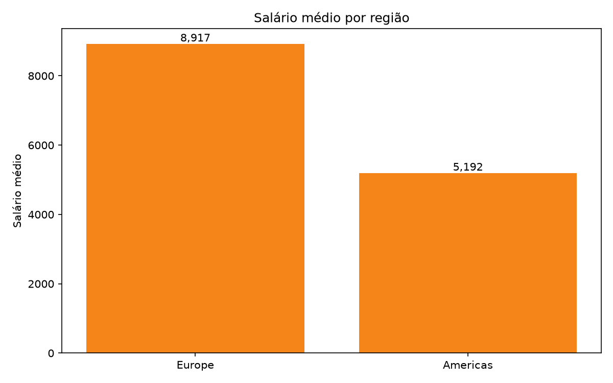
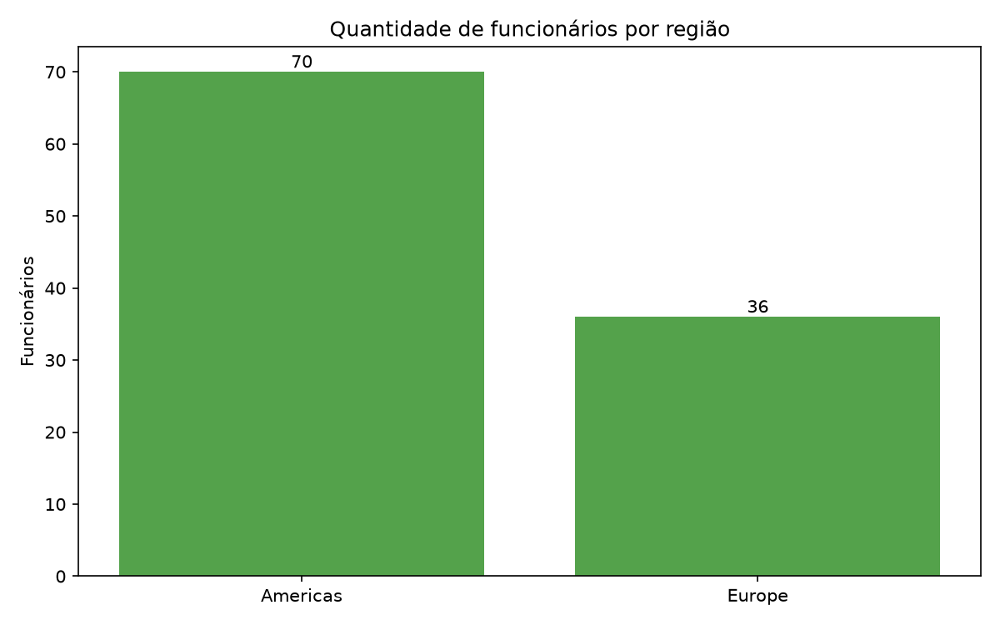

# Análise de Dados de RH — Salários, Cargos, Departamentos e Regiões

**Aluno:** Bruna M Leal
**Turma:** T3
**Disciplina:** Visualização de Dados e Business Intelligence 

## 1. Objetivo

Atuar como analista de dados da área de Recursos Humanos para entender a distribuição de salários entre departamentos e cargos e os padrões de remuneração por região geográfica, usando SQL (banco FreeSQL, esquema HR) e Python (pandas e matplotlib).

## 2. Tabelas utilizadas (esquema HR)

| Tabela | Descrição | Campos principais |
|---|---|---|
| `EMPLOYEES` | Funcionários da empresa | EMPLOYEE_ID, FIRST_NAME, LAST_NAME, JOB_ID, SALARY, DEPARTMENT_ID |
| `DEPARTMENTS` | Departamentos | DEPARTMENT_ID, DEPARTMENT_NAME, LOCATION_ID |
| `JOBS` | Cargos e faixas salariais | JOB_ID, JOB_TITLE, MIN_SALARY, MAX_SALARY |
| `LOCATIONS` | Locais (endereço, cidade, estado) | LOCATION_ID, CITY, STATE_PROVINCE, COUNTRY_ID |
| `COUNTRIES` | Países | COUNTRY_ID, COUNTRY_NAME, REGION_ID |
| `REGIONS` | Regiões do mundo | REGION_ID, REGION_NAME |

## 3. Consultas SQL

Ambas utilizam **LEFT JOIN** e um **WHERE** simples.

**`sql/query_1.sql` — Salário por departamento e cargo**
- `EMPLOYEES` com `LEFT JOIN` em `DEPARTMENTS` e `JOBS` (2 LEFT JOIN).
- Filtro: `WHERE e.DEPARTMENT_ID IS NOT NULL`, que remove funcionários sem departamento para que a comparação entre departamentos considere apenas quem está alocado.
- Resultado exportado em `data/query_01.csv`.

**`sql/query_2.sql` — Funcionários por região, com localização**
- `EMPLOYEES` com `LEFT JOIN` em `DEPARTMENTS`, `LOCATIONS`, `COUNTRIES` e `REGIONS` (4 LEFT JOIN).
- Filtro: `WHERE r.REGION_NAME IS NOT NULL`, que mantém apenas funcionários cuja região foi identificada.
- Resultado exportado em `data/query_02.csv`.

## 4. Análise em Python

O script `src/analise.py` realiza:

1. **Carga** dos CSVs e padronização das colunas.
2. **EDA**: dimensões, tipos de dados, valores nulos e duplicados.
3. **Medidas estatísticas** do salário: média, mediana, mínimo, máximo e desvio padrão.
4. **Agrupamentos** por departamento, cargo, região, país e cidade.
5. **Gráficos** (salvos em `images/`):
   - Histograma da distribuição de salários
   - Boxplot de salários por departamento
   - Barras do salário médio por região
   - Barras da quantidade de funcionários por região

## 5. Principais resultados

**Medidas estatísticas do salário (106 funcionários com departamento):**

| Média | Mediana | Mínimo | Máximo | Desvio padrão |
|---|---|---|---|---|
| 6.456,75 | 6.150,00 | 2.100 | 24.000 | 3.927,80 |

**Principais observações:**

- **Departamentos e cargos:** o departamento com maior salário médio é o *Executive* (19.333,33), formado por apenas 3 pessoas. O menor é o *Shipping* (3.475,56), que também é o maior departamento, com 45 funcionários. O *Sales* tem 34 funcionários e média de 8.955,88. Por cargo, o *President* recebe 24.000, enquanto o *Stock Clerk* tem média de 2.785, uma diferença de cerca de 8,6 vezes.
- **Concentração de funcionários:** *Shipping* e *Sales* juntos reúnem 79 dos 106 funcionários (cerca de 75%), então eles influenciam fortemente as médias gerais.
- **Regiões:** a região *Americas* concentra 70 funcionários (66%), com salário médio de 5.191,66 e mediana de 3.300. A região *Europe* tem 36 funcionários, com média de 8.916,67 e mediana de 8.900, ou seja, uma média cerca de 72% maior que a das Américas.
- **Por local:** South San Francisco (45 funcionários, média de 3.475,56) puxa a média das Américas para baixo, enquanto Seattle tem média de 8.845,33 por abrigar a diretoria. Oxford, na Europa, tem 34 funcionários com média de 8.955,88.
- **Média x mediana:** no conjunto total, a média (6.456,75) ficou próxima da mediana (6.150,00), com diferença de cerca de 307 (5%). Isso indica uma leve assimetria à direita, causada por poucos salários altos (cargos de diretoria). Já nas Américas a diferença é grande (média 5.191,66 contra mediana 3.300), o que mostra uma distribuição bem assimétrica.
- **Principal insight:** as diferenças salariais por região refletem principalmente a *composição dos departamentos* em cada local. Departamentos operacionais (Shipping) concentram salários baixos e ficam nas Américas, enquanto a Europa tem principalmente Sales, com salários mais altos. Ou seja, a região por si só não explica a diferença.
- **Limitações:** a região é definida pela localização do departamento, não pela residência do funcionário. A base é pequena (106 registros), alguns departamentos têm só 1 a 3 pessoas (as médias ficam pouco representativas) e a análise não considera tempo de casa, senioridade nem comissões. Um funcionário sem departamento ficou fora das duas consultas pelo filtro `WHERE`. Por isso, os resultados servem como apoio e não devem ser a única base para decisões de RH.

### Gráficos






## 6. Como executar

**Pré-requisitos:** Python 3.9+ e Git.
```bash
# 1. Clonar o repositório
git clone https://github.com/brumleal/projeto-hr-bi.git
cd projeto-hr-bi

# 2. (Opcional) criar ambiente virtual
python -m venv venv
venv\Scripts\activate           # Windows
# source venv/bin/activate      # Mac/Linux

# 3. Instalar as bibliotecas
pip install -r requirements.txt

# 4. Executar a análise
python src/analise.py
```

**Para regerar os CSVs (opcional):**
1. Acesse https://freesql.com/ e entre no esquema HR.
2. Execute `sql/query_1.sql` e exporte o resultado como `data/query_01.csv`.
3. Execute `sql/query_2.sql` e exporte o resultado como `data/query_02.csv`.

## 7. Estrutura do repositório

```
projeto-hr-bi/
├── README.md
├── requirements.txt
├── sql/
│   ├── query_1.sql
│   └── query_2.sql
├── data/
│   ├── query_01.csv
│   └── query_02.csv
├── src/
│   └── analise.py
└── images/
```

## 8. Vídeo de apresentação

Vídeo não incluído nesta entrega.

## 9. Sugestões de melhoria para versões futuras

- Incluir a tabela `JOB_HISTORY` para analisar a evolução de cargos e salários ao longo do tempo.
- Considerar `COMMISSION_PCT` para calcular a remuneração total.
- Comparar o salário de cada funcionário com a faixa do cargo (`MIN_SALARY` e `MAX_SALARY`).
- Criar um dashboard interativo (Power BI, Streamlit ou Plotly).
- Analisar o tempo de casa (`HIRE_DATE`) e sua relação com o salário.
